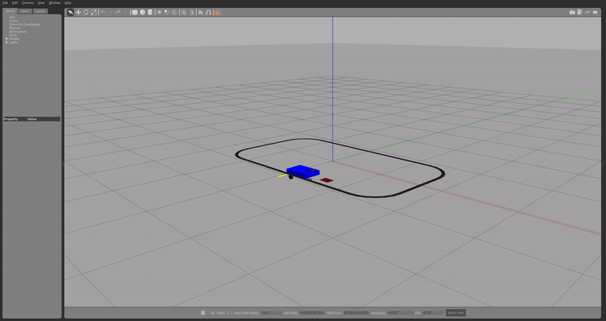
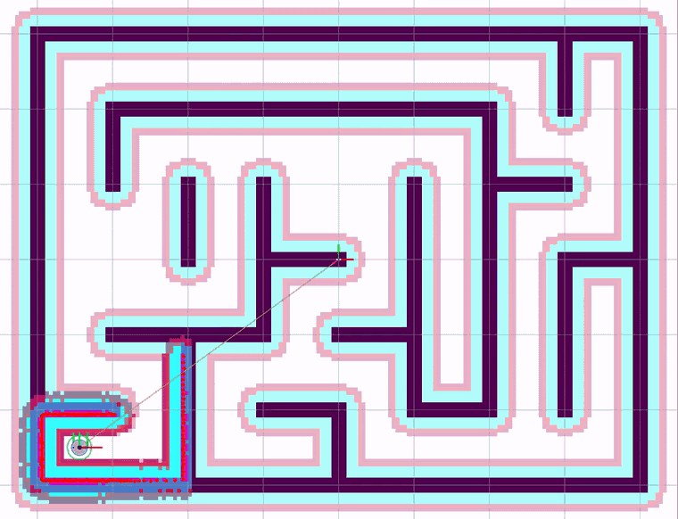

# ros2-robot-projects

> **ROS 2 / Gazebo line-following robot with vision, obstacle avoidance and a reproducible tuning bench — plus SLAM mapping and Nav2 navigation in a generated maze.**
> 两个从零自学的 ROS 2 项目：一台视觉巡线 + 避障小车（含 18 圈可复现调参台架），一台在程序生成迷宫里跑 Cartographer 建图与 Nav2 自主导航的差速小车。

## 两个项目

### mybot —— 视觉巡线 + 避障小车 · [项目 README](mybot/README.md)

一圈 **30.8 s**、横向偏差（里程加权 |e|）**1.07 cm**、舵量饱和 0 帧；避障在障碍前 29.6 cm 停死，删掉障碍后自己恢复并跑完一圈。
从手写 URDF 起步，一路做到 HSV 分割 → 逆透视米制线特征 → PD 巡线 → 避障状态机 → ESP32 差速混控层。



另有：[蛇形 vs 整定后（左右同步对比）](mybot/docs/assets/d12_compare.gif) · [避障停车与恢复](mybot/docs/assets/d11_avoid.gif)

### maze_nav2 —— 迷宫里的建图与导航 · [项目 README](maze_nav2/README.md)

Nav2 自主导航全程 **SUCCEEDED**、**0 次恢复行为**、到达时距目标 **0.246 m**（容差 0.25 m）。
程序生成的 8×6 m 迷宫（走廊净宽 0.88 m），Cartographer 建图与 Nav2 导航共用同一套仿真。



## 关键数字

| 项目 | 指标 | 数值 | 出处 |
|---|---|---|---|
| mybot | 完整一圈用时 | **30.8 s**（两批各 3 次，共 6 跑） | D12 台架（18 圈 + 整批复跑） |
| mybot | 巡线精度（里程加权 \|e\|） | **1.07 cm**（逐帧 1.11 / p95 3.00） | `d12_recompute.py` 从 CSV 独立复算 |
| mybot | 舵量饱和帧 | **0**（18 跑全 0，且已核实是真 0） | 同上 |
| mybot | 避障停距 | **29.6 cm**（障碍前停死 → 删障后自行恢复跑完） | D11 验收 |
| mybot | 固件混控断言 | **33 条**（符号 / 饱和等比缩 / NaN→刹车 / 死区 / 单位往返） | `test_mixer.cpp` |
| maze_nav2 | 导航结果 | **SUCCEEDED · 0 恢复 · 末距 0.246 m**（55.6 s 仿真时间） | 2026-09-20 实录（`navigate` 模式） |

## 工程方法（为什么这些数字可信）

- **先立口径再调参**：巡线主指标是**里程加权 |e|**（每帧误差 × 该帧行进距离 / 总里程）。
  20 Hz 定频采样下"逐帧平均"等价于按时间加权——车在弯里走得慢、弯道占的帧多，
  均值被"在弯里待了多久"污染；同一份 CSV 换口径后，会话内重复极差从 0.23 cm 收到 0.03 cm。
  判档容差随噪声底定在 ±0.05 cm，报中位数必须同时报极差；差值小于噪声底就写"与最优同档"，不报名次。
- **可复现台架**：6 配置 × 3 重复 = 18 圈，每跑自动"复位 → 等 /odom 归零 → 验起跑点（在起点直线上）"
  三段把关；指标全部由脚本从轨迹 CSV **独立复算**，不采信节点自己打印的汇总；
  并整批复跑一次（跨会话 12 跑/配置族）核对——两条路指向同一组数字。
- **验收数字优先于叙述**：每个结论都给出可比数字与出处；不可复算的数据（原始 CSV 丢失的那批）
  在文档里显式标注"无法再逐帧复核"并降级为参考，不作依据。

## 环境与怎么跑

WSL2 · Ubuntu 22.04 · ROS 2 Humble · Gazebo Classic。依赖安装与启动步骤各自写在
[mybot/README.md](mybot/README.md) 与 [maze_nav2/README.md](maze_nav2/README.md) 里，这里不重复正文。
两个项目都保持"克隆 → `colcon build` → 一条命令启动"的可运行状态；演示 GIF 全部来自真实仿真录制（非渲染图）。

## 结构导览

```
ros2-robot-projects/
├── mybot/                      # 项目一：巡线 + 避障（保留 D1–D13 逐日提交历史）
│   ├── mybot_description/      #   URDF/xacro、世界、launch（D1–D7）
│   ├── mybot_control/          #   视觉、PD、避障、台架脚本、ESP32 固件（D8–D13）
│   └── docs/assets/            #   演示 GIF：主图 / 蛇形对比 / 避障
├── maze_nav2/                  # 项目二：迷宫 Cartographer + Nav2
│   ├── src/maze_bot/           #   单包：launch / config / maps / urdf / worlds / scripts
│   └── docs/assets/            #   演示 GIF（导航实录）+ TF 树图
├── LICENSE · .gitignore · .gitattributes
```

两个 `docs/assets/` 只放演示素材，不参与构建。

## License

Apache-2.0，见 [LICENSE](LICENSE)。

## 联系方式

`241040500115@stu.haut.edu.cn`（简历投递用）
